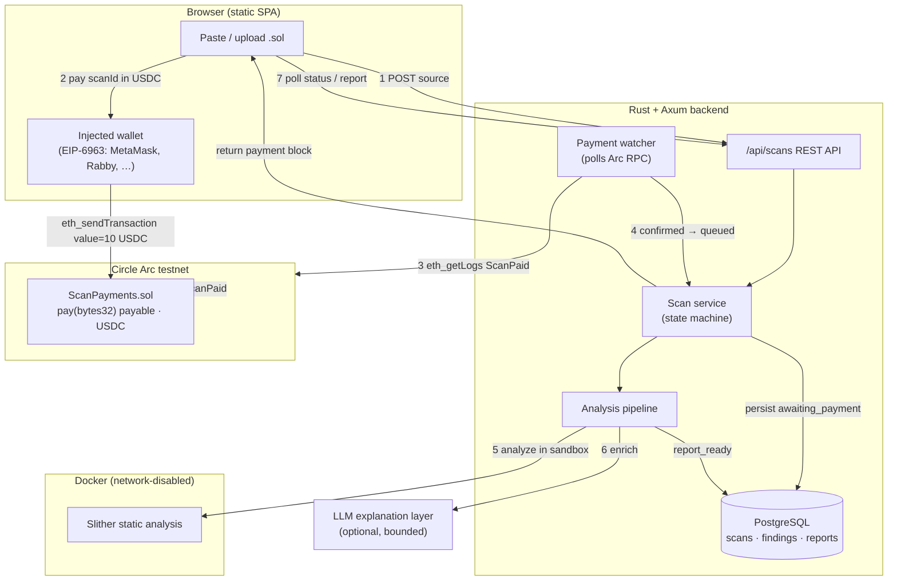

# ContractScanner — pay-per-scan Solidity security auditing, settled in USDC on Arc

> Paste a Solidity contract, pay a small USDC fee on **Circle's Arc** testnet, and
> get a sandboxed static-analysis report with risk-scored, human-readable findings.

ContractScanner is a **pay-per-use AI security service**. Each scan is unlocked by
an on-chain USDC micropayment on Arc; once the payment is confirmed, the backend
runs [Slither](https://github.com/crytic/slither) inside a network-disabled Docker
sandbox, normalizes and risk-scores the findings, optionally enriches them with an
LLM explanation layer, and returns an actionable report (viewable in the UI and
exportable as JSON or Markdown).

- **Live demo:** http://www.gaziblockchain.tech/
- **Video walk-through:** https://drive.google.com/file/d/1p5cYC1xNCt9HxHwnUOp86WR6IbvDfagt/view?usp=drive_link
- **Track:** Best Agentic Economy Experience on Arc (pay-per-inference / pay-per-use AI service)
- **Circle products used:** **USDC** (native settlement rail on Arc)

---

## Why USDC on Arc

A security scan is a discrete, metered unit of compute — a natural fit for a
**pay-per-use** rail. Arc makes this clean:

- On Arc, **USDC is the native asset** used for gas and value transfer, so a scan
  fee is collected directly via `msg.value` — **no ERC-20 `approve` round-trip**,
  one wallet confirmation per scan.
- **Deterministic finality** means the backend can flip a scan from
  `awaiting_payment` to `queued` as soon as the `ScanPaid` event confirms, giving
  the user a real-time "pay → scan starts" experience.
- **Dollar-denominated fees** make per-scan pricing legible to non-crypto users
  (10 USDC/scan, fixed and immutable in the contract).

> On Arc, native USDC (`msg.value`) uses **18 decimals**, while the USDC ERC-20
> interface uses 6. `PRICE = 10 * 10**18` in the contract therefore means **10 USDC**.

---

## Architecture



**Flow:** the frontend creates a scan (`awaiting_payment`) and gets back a payment
block (contract address, `scanId` as `bytes32`, price, chain id). The wallet calls
`pay(bytes32 scanId)` on Arc with the USDC fee attached as native value. The
backend's payment watcher polls Arc for the `ScanPaid` event; on confirmation it
moves the scan to `queued` and runs the pipeline. The page polls until
`report_ready`, then renders the report.

### Components

| Layer | Tech | Location |
|-------|------|----------|
| Payment contract | Solidity (Foundry) | [`contracts/ScanPayments.sol`](contracts/ScanPayments.sol) |
| Payment watcher | Rust, raw JSON-RPC over Arc | [`src/infra/payment_watcher.rs`](src/infra/payment_watcher.rs) |
| API / state machine | Rust + Axum, sqlx | [`src/api/`](src/api), [`src/services/`](src/services) |
| Analysis pipeline | Slither in Docker + risk scorer + LLM layer | [`src/analyzers/`](src/analyzers) |
| Frontend | Vanilla HTML/CSS/JS, EIP-6963 wallet picker | [`static/index.html`](static/index.html) |
| Storage | PostgreSQL | [`migrations/`](migrations) |

---

## The payment contract

[`contracts/ScanPayments.sol`](contracts/ScanPayments.sol) is a self-contained,
import-free fixed-price gate:

```solidity
uint256 public constant PRICE = 10 * (10 ** 18); // 10 USDC (native, 18 dp on Arc)

function pay(bytes32 scanId) external payable {
    if (msg.value < PRICE) revert Underpaid();
    if (paid[scanId]) revert AlreadyPaid();   // replay protection
    paid[scanId] = true;
    emit ScanPaid(scanId, msg.sender, msg.value);
}
```

- `scanId` is the backend's UUID left-padded to `bytes32`, linking the on-chain
  payment to the off-chain scan.
- Immutable price, no `setPrice`, no fee admin — the only privileged action is
  `withdraw` (two-step `Ownable2Step`-style ownership).
- The backend trusts the scan only after `PAYMENT_CONFIRMATIONS` blocks and
  re-verifies `amount >= price` defensively.

---

## Running locally

### Prerequisites

- Rust (stable) + Cargo
- PostgreSQL 14+
- Docker (for the Slither sandbox)
- Foundry (`forge`) — only needed to deploy the contract to Arc

### 1. Configure

```bash
cp .env.example .env
# set DATABASE_URL, and (optionally) LLM_API_KEY / LLM_BASE_URL
```

### 2. Database

```bash
# migrations run from the migrations/ folder via sqlx
createdb contract_scanner
# apply migrations (or let the app do it on boot, per your setup)
```

### 3. Build the Slither sandbox image

```bash
docker build -t contract-scanner-slither:latest -f docker/slither.Dockerfile .
```

### 4. Run

```bash
# PAYMENT_BYPASS=true starts scans without an on-chain payment — ideal for local dev
cargo run
# open http://127.0.0.1:8080
```

---

## Enabling the live USDC gate on Arc

1. **Fund the deployer** with testnet USDC (used for gas on Arc) from the Circle
   faucet: https://faucet.circle.com → select **Arc Testnet**.
2. **Deploy the contract:**
   ```powershell
   pwsh ./scripts/deploy-arc.ps1
   ```
   or with Foundry directly:
   ```bash
   forge create contracts/ScanPayments.sol:ScanPayments \
     --rpc-url https://rpc.testnet.arc.network \
     --private-key $DEPLOYER_PRIVATE_KEY --broadcast
   ```
3. **Wire it up** in `.env`:
   ```ini
   PAYMENT_CONTRACT_ADDRESS=0x...   # deployed address
   ARC_RPC_HTTP_URL=https://rpc.testnet.arc.network
   CHAIN_ID=5042002
   PAYMENT_BYPASS=false
   ```
4. Restart the server. The payment watcher begins polling Arc, and the UI's
   **Connect wallet → pay** flow submits `pay(bytes32)` with 10 USDC attached.

### Arc testnet reference

| | Value |
|---|---|
| Chain ID | `5042002` (hex `0x4cf0b2`) |
| RPC | `https://rpc.testnet.arc.network` |
| Explorer | `https://testnet.arcscan.app` |
| Native currency | **USDC** (18 decimals native / 6 decimals ERC-20 interface) |
| USDC ERC-20 address | `0x3600000000000000000000000000000000000000` |

---

## API

| Method | Path | Purpose |
|--------|------|---------|
| `GET`  | `/` | Frontend SPA |
| `GET`  | `/health` | Liveness probe |
| `POST` | `/api/scans` | Create a scan → `201` with payment block |
| `GET`  | `/api/scans/{id}` | Scan status (drives the progress UI) |
| `GET`  | `/api/scans/{id}/report` | Full report (JSON) |
| `GET`  | `/api/scans/{id}/export/json` | Report as downloadable JSON |
| `GET`  | `/api/scans/{id}/export/markdown` | Report as Markdown |

The `POST /api/scans` response includes a **payment block** the frontend uses to
build the on-chain call:

```json
{
  "scan_id": "…",
  "status": "awaiting_payment",
  "payment": {
    "contract_address": "0x…",
    "chain_id": 5042002,
    "scan_id_bytes32": "0x…",
    "price_wei": "10000000000000000000",
    "expires_at": "2026-…",
    "bypassed": false
  }
}
```

---

## Security notes

- Source is analyzed in a **network-disabled Docker container**; source code is
  never logged.
- Client IPs are hashed (`IP_HASH_SALT`), never stored raw; per-IP rate limiting
  and concurrency caps guard the sandbox.
- The payment gate has replay protection (`paid[scanId]`) and only trusts payments
  after N confirmations.
- **Never commit `.env`** — it is gitignored. The `DEPLOYER_PRIVATE_KEY` in local
  `.env` is a throwaway testnet key; rotate/replace it for any real deployment.

---

## Repository layout

```
contracts/ScanPayments.sol   USDC payment gate (Arc)
src/api/                     Axum routes
src/services/scan_service.rs Scan state machine
src/infra/payment_watcher.rs Arc RPC event watcher
src/analyzers/               Slither adapter, normalizer, risk scorer, LLM layer
static/index.html            Single-file frontend + wallet flow
migrations/                  PostgreSQL schema
scripts/deploy-arc.ps1       One-command Arc deploy
docs/ARCHITECTURE.md         Detailed architecture
SUBMISSION.md                Hackathon submission form answers + Circle feedback
```

> `PROJECT_BLUEPRINT.md` is the original internal design document and predates the
> Arc migration; `README.md` and `docs/ARCHITECTURE.md` are the current references.
