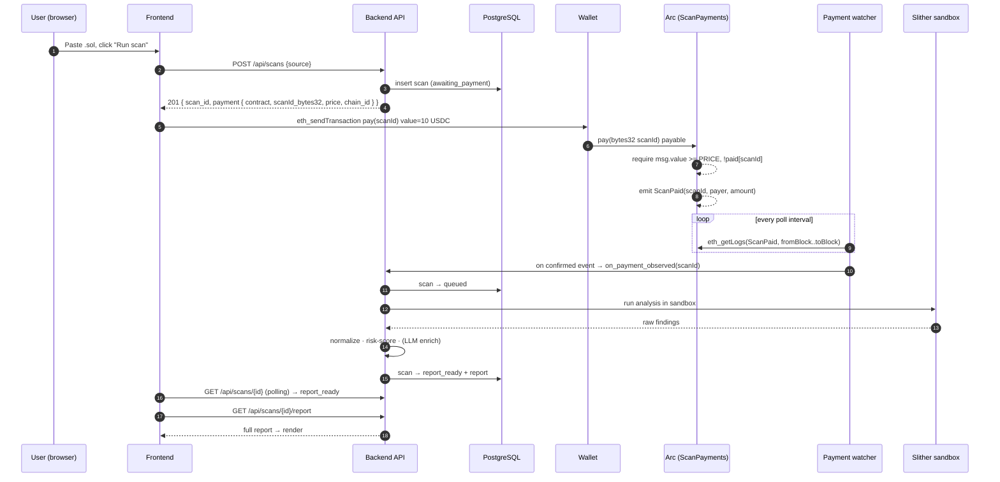
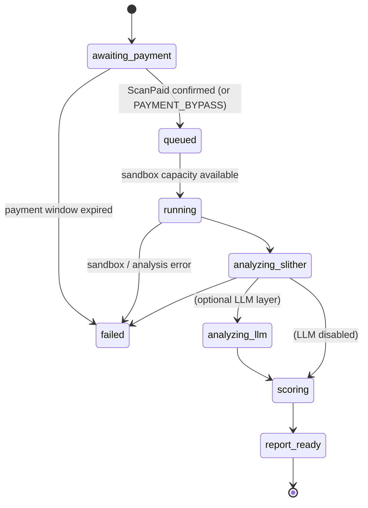

# ContractScanner — Architecture

ContractScanner is a **pay-per-scan Solidity security auditor** whose scans are gated
by **USDC micropayments on Circle's Arc** testnet. This document details the system
components, the payment flow, and the scan state machine.

## System diagram

```mermaid
flowchart LR
    subgraph Client["Browser — static SPA (static/index.html)"]
        UI["Editor: paste / upload .sol"]
        POLL["Status poller (2s)"]
        WAL["EIP-6963 wallet picker"]
    end

    subgraph Backend["Rust + Axum service"]
        API["REST API (src/api)"]
        SVC["Scan service / state machine<br/>(src/services/scan_service.rs)"]
        PIPE["Analyzer pipeline<br/>(src/analyzers)"]
        WATCH["Payment watcher<br/>(src/infra/payment_watcher.rs)"]
        DB[("PostgreSQL")]
    end

    subgraph Sandbox["Docker — network disabled"]
        SLI["Slither (docker/slither.Dockerfile)"]
    end

    subgraph ArcNet["Circle Arc testnet — chain 5042002"]
        SC["ScanPayments.sol<br/>pay(bytes32) payable · USDC"]
    end

    LLM["LLM explanation layer<br/>(optional · bounded)"]

    UI --> API
    POLL --> API
    API --> SVC
    SVC <--> DB
    WAL -->|pay(scanId) + 10 USDC value| SC
    SC -->|ScanPaid event| ArcNet
    WATCH -->|poll eth_getLogs| ArcNet
    WATCH --> SVC
    SVC --> PIPE
    PIPE --> SLI
    PIPE --> LLM
    PIPE --> DB
```

## Payment sequence



## Scan state machine



## Key design decisions

- **USDC as native value, not ERC-20 transfer.** On Arc, USDC is the native gas/value
  asset, so the fee is attached to the `pay(bytes32)` call as `msg.value`. This
  removes the `approve` + `transferFrom` two-step and keeps
  [`ScanPayments.sol`](../contracts/ScanPayments.sol) import-free and easy to verify.
- **Event-driven settlement, not trusting the client.** The frontend never tells the
  backend "I paid." The backend only advances a scan after its own watcher observes a
  confirmed `ScanPaid` log on Arc (with `PAYMENT_CONFIRMATIONS` blocks) and
  re-verifies `amount >= price`. See
  [`payment_watcher.rs`](../src/infra/payment_watcher.rs).
- **Restart-safe watcher.** `last_processed_block` is persisted, so the watcher
  resumes after a restart and fast-forwards past windows older than the payment
  expiry rather than replaying history.
- **`scanId` binds on-chain to off-chain.** The backend UUID is left-padded to
  `bytes32` and used as the `pay(bytes32 scanId)` argument and the indexed event
  topic, so each payment maps to exactly one scan and cannot be replayed
  (`paid[scanId]`).
- **Sandbox isolation.** Analysis runs in a network-disabled Docker container with
  size/line caps, per-IP rate limiting, and hashed client IPs; source is never
  logged.
- **Bounded LLM layer.** The explanation layer is optional (disabled when no API key
  is set) and windows large sources rather than sending unbounded input.

## Decimal handling (Arc-specific)

| Representation | Decimals | Example: 10 USDC |
|----------------|----------|------------------|
| Native value (`msg.value`, `address.balance`) | 18 | `10_000000000000000000` |
| USDC ERC-20 interface (`balanceOf`, `transfer`) | 6 | `10_000000` |

The contract's `PRICE = 10 * 10**18` and the backend's `SCAN_PRICE_WEI` are both in
**18-decimal native units**. Convert native → ERC-20 by dividing by `10^12`.
